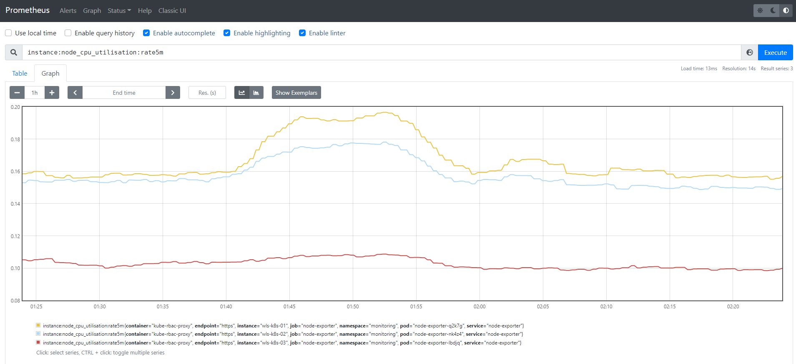
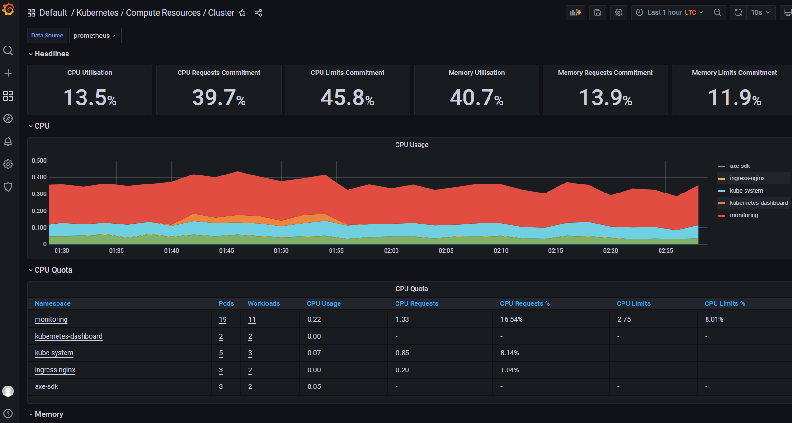

tags: addons, kube-prometheus, prometheus, grafana

# 08-4. 部署 kube-prometheus 插架
<!-- TOC -->

- [08-4. 部署 kube-prometheus 插架](#08-4-部署-kube-prometheus-插架)
    - [下载和安装](#下载和安装)
    - [查看运行状态](#查看运行状态)
    - [访问 Prometheus UI](#访问-prometheus-ui)
    - [访问 Grafana UI](#访问-grafana-ui)

<!-- /TOC -->

kube-prometheus 是一整套监控解决方案，它使用 Prometheus 采集集群指标，Grafana 做展示，包含如下组件：
+ The Prometheus Operator
+ Highly available Prometheus
+ Highly available Alertmanager
+ Prometheus node-exporter
+ Prometheus Adapter for Kubernetes Metrics APIs （k8s-prometheus-adapter）
+ kube-state-metrics
+ Grafana

其中 k8s-prometheus-adapter 使用 Prometheus 实现了 metrics.k8s.io 和 custom.metrics.k8s.io API，所以**不需要再部署** `metrics-server`。
如果要单独部署 `metrics-server`，请参考：[C.metrics-server插件.md](C.metrics-server插件.md)

如果没有特殊指明，本文档的所有操作**均在 wls-k8s-01 节点上执行**；

## 下载和安装

``` bash
cd /opt/k8s/work
wget https://github.com/prometheus-operator/kube-prometheus/archive/refs/tags/v0.10.0.tar.gz && unzip v0.10.0.tar.gz
cd kube-prometheus-0.10.0/
sed -i -e 's_quay.io_quay.mirrors.ustc.edu.cn_' manifests/*.yaml manifests/setup/*.yaml # 使用中科大的 Registry
sed -i -e 's_k8s.gcr.io/kube-state-metrics_docker.io/15908174512_' kubeStateMetrics-deployment.yaml  # docker个人仓库
sed -i -e 's_k8s.gcr.io/prometheus-adapter_docker.io/15908174512_' prometheusAdapter-deployment.yaml
kubectl apply -f manifests/setup # 安装 prometheus-operator
kubectl apply -f manifests/ # 安装 promethes metric adapter
```

## 查看运行状态

``` bash
$ kubectl get pods -n monitoring
NAME                                   READY   STATUS    RESTARTS      AGE
alertmanager-main-0                    2/2     Running   0             70d
alertmanager-main-1                    2/2     Running   0             70d
alertmanager-main-2                    2/2     Running   0             51d
blackbox-exporter-58fbf7968-q7bvz      3/3     Running   0             70d
dingtalk-webhook-58876d8fc5-4jcdg      1/1     Running   0             19h
grafana-7fd69887fb-vd7c6               1/1     Running   0             51d
kube-state-metrics-6c95dfb5b6-j6xzl    3/3     Running   0             70d
loki-0                                 1/1     Running   0             47d
node-exporter-lbdjq                    2/2     Running   6 (51d ago)   70d
node-exporter-nk4z4                    2/2     Running   0             70d
node-exporter-q2k7g                    2/2     Running   0             70d
prometheus-adapter-6b9bdc8685-p5m4t    1/1     Running   0             51d
prometheus-adapter-6b9bdc8685-zjvcc    1/1     Running   0             70d
prometheus-k8s-0                       2/2     Running   0             70d
prometheus-k8s-1                       2/2     Running   0             70d
prometheus-operator-7856bfd755-rccwr   2/2     Running   0             70d
promtail-h28c4                         1/1     Running   0             47d
promtail-ljmpx                         1/1     Running   0             47d
promtail-sw4lg                         1/1     Running   0             47d
```

``` bash
$ kubectl top pods -n monitoring
NAME                                   CPU(cores)   MEMORY(bytes)   
alertmanager-main-0                    2m           36Mi            
alertmanager-main-1                    2m           32Mi            
alertmanager-main-2                    2m           32Mi            
blackbox-exporter-58fbf7968-q7bvz      0m           22Mi            
dingtalk-webhook-58876d8fc5-4jcdg      0m           10Mi            
grafana-7fd69887fb-vd7c6               7m           75Mi            
kube-state-metrics-6c95dfb5b6-j6xzl    0m           41Mi            
loki-0                                 1m           48Mi            
node-exporter-lbdjq                    4m           33Mi            
node-exporter-nk4z4                    3m           28Mi            
node-exporter-q2k7g                    3m           27Mi            
prometheus-adapter-6b9bdc8685-p5m4t    3m           32Mi            
prometheus-adapter-6b9bdc8685-zjvcc    3m           35Mi            
prometheus-k8s-0                       75m          688Mi           
prometheus-k8s-1                       160m         692Mi           
prometheus-operator-7856bfd755-rccwr   0m           41Mi            
promtail-h28c4                         6m           32Mi            
promtail-ljmpx                         7m           26Mi            
promtail-sw4lg                         9m           31Mi  
```

## 访问 Prometheus UI

启动服务代理：

``` bash
$ 
$ kubectl port-forward --address 0.0.0.0 pod/prometheus-k8s-0 -n monitoring 9090:9090
Forwarding from 0.0.0.0:9090 -> 9090
```
+ port-forward 依赖 socat。

浏览器访问：http://10.0.0.5:9090/graph?g0.expr=&g0.tab=1&g0.stacked=0&g0.show_exemplars=0&g0.range_input=1h




## 访问 Grafana UI

启动代理：

``` bash
$ kubectl port-forward --address 0.0.0.0 svc/grafana -n monitoring 3000:3000 
Forwarding from 0.0.0.0:3000 -> 3000
```

浏览器访问：http://10.0.0.5:3000/

用 admin/admin 登录：


然后，就可以看到各种预定义的 dashboard 了：



## 添加监控kube-controller-manager、kube-scheduler、kube-proxy

因为各组件采用二进制安装，没有对应Service资源对象，Prometheus Operator采集不到数据，需要手动创建Service、Endpoints资源

创建扩展配置存放目录：

```
cd /opt/k8s/work/kube-prometheus-0.10.0/manifests && mkdir patch
```

kube-controller-manager：

``` bash
cd /opt/k8s/work/kube-prometheus-0.10.0/manifests/patch
cat > controller-service.yaml <<EOF
apiVersion: v1
kind: Service
metadata:
  name: kube-controller-manager-monitoring
  namespace: kube-system
  labels:
    app.kubernetes.io/name: kube-controller-manager
spec:
  ports:
  - port: 10257
    name: https-metrics
    protocol: TCP
  type: ClusterIP
EOF

cat controller-endpoint.yaml <<EOF
apiVersion: v1
kind: Endpoints
metadata:
  name: kube-controller-manager-monitoring
  namespace: kube-system
  labels:
    app.kubernetes.io/name: kube-controller-manager
subsets:
  - addresses:
    - ip: 10.0.0.5
    - ip: 10.0.0.12
    - ip: 10.0.0.8
    ports:
    - name: https-metrics
      port: 10257
      protocol: TCP
EOF
```

kube-scheduler：

```bash
cd /opt/k8s/work/kube-prometheus-0.10.0/manifests/patch
cat scheduler-service.yaml <<EOF
apiVersion: v1
kind: Service
metadata:
  name: kube-scheduler-monitoring
  namespace: kube-system
  labels:
    app.kubernetes.io/name: kube-scheduler
spec:
  ports:
  - port: 10259
    name: https-metrics
    protocol: TCP
  type: ClusterIP
EOF

cat scheduler-endpoint.yaml <<EOF
apiVersion: v1
kind: Endpoints
metadata:
  name: kube-scheduler-monitoring
  namespace: kube-system
  labels:
    app.kubernetes.io/name: kube-scheduler
subsets:
  - addresses:
    - ip: 10.0.0.5
    - ip: 10.0.0.12
    - ip: 10.0.0.8
    ports:
    - name: https-metrics
      port: 10259
      protocol: TCP
EOF
```

kube-proxy：

```bash
cd /opt/k8s/work/kube-prometheus-0.10.0/manifests/patch
cat kubernetesControlPlane-serviceMonitorKubeProxy.yaml <<EOF
apiVersion: monitoring.coreos.com/v1
kind: ServiceMonitor
metadata:
  labels:
    app.kubernetes.io/name: kube-proxy
    app.kubernetes.io/part-of: kube-proxy
  name: kube-proxy
  namespace: monitoring
spec:
  endpoints:
  - bearerTokenFile: /var/run/secrets/kubernetes.io/serviceaccount/token
    interval: 30s
    port: http-metrics
    scheme: http
    tlsConfig:
      insecureSkipVerify: true
  jobLabel: app.kubernetes.io/name
  namespaceSelector:
    matchNames:
    - kube-system
  selector:
    matchLabels:
      app.kubernetes.io/name: kube-proxy
EOF

cat proxy-service.yaml <<EOF
apiVersion: v1
kind: Service
metadata:
  name: kube-proxy-monitoring
  namespace: kube-system
  labels:
    app.kubernetes.io/name: kube-proxy
spec:
  ports:
  - port: 10249
    name: http-metrics
    protocol: TCP
  type: ClusterIP
EOF

cat proxy-endpoint.yaml <<EOF
apiVersion: v1
kind: Endpoints
metadata:
  name: kube-proxy-monitoring
  namespace: kube-system
  labels:
    app.kubernetes.io/name: kube-proxy
subsets:
  - addresses:
    - ip: 10.0.0.5
    - ip: 10.0.0.12
    - ip: 10.0.0.8
    ports:
    - name: http-metrics
      port: 10249
      protocol: TCP
EOF
```

- kube-proxy没有实现动态添加，每次添加新node，都需要将ip加入Endpoints

应用以上文件配置：

```
cd /opt/k8s/work/kube-prometheus-0.10.0/manifests/patch
kubectl apply -f .
```


## 添加钉钉告警

一个简易的钉钉webhook：https://github.com/wd16yuan/alertmanaer-dingtalk-webhook.git

构建钉钉webhook镜像：

```bash
git clone https://github.com/wd16yuan/alertmanaer-dingtalk-webhook.git
cd alertmanaer-dingtalk-webhook/
docker build -t yourharbor/alertmanaer-dingtalk-webhook:v2022092014 .
docker push yourharbor/alertmanaer-dingtalk-webhook:v2022092014
```

获取钉钉token、secret密文：

```
docker run --rm yourharbor/alertmanaer-dingtalk-webhook:v2022092014 -convert -token=qwertyuiop123456789 -secret=asdfghjkl987654321
Convert plaintext to ciphertext:
"qwertyuiop123456789" ======>>>  "+IBLpa7mj3yvpSBGXQBf2IbfAg=="
"asdfghjkl987654321" ======>>>  "6IRKsb33kH6s7ClDWAFe3VU4"
```

- 替换成你的 token、secret，获取密文

创建Deployment + Service配置：

```bash
cat dingtalk-webhook.yaml <<EOF
apiVersion: apps/v1
kind: Deployment
metadata:
  name: dingtalk-webhook
  labels:
    app: dingtalk-webhook
  namespace: monitoring
spec:
  replicas: 1
  selector:
    matchLabels:
      app: dingtalk-webhook
  template:
    metadata:
      labels:
        app: dingtalk-webhook
    spec:
      affinity:
        nodeAffinity:
          requiredDuringSchedulingIgnoredDuringExecution:
            nodeSelectorTerms:
            - matchExpressions:
              - key: kubernetes.io/hostname
                operator: In
                values:
                - wls-k8s-01
      containers:
        - name: dingtalk-webhook
          image: yourharbor/alertmanaer-dingtalk-webhook:v2022092014
          imagePullPolicy: IfNotPresent
          args:
            - -secret=+IBLpa7mj3yvpSBGXQBf2IbfAg==
            - -token=6IRKsb33kH6s7ClDWAFe3VU4
          env:
            - name: TZ
              value: Asia/Shanghai
          ports:
            - containerPort: 8080
              protocol: TCP

---
apiVersion: v1
kind: Service
metadata:
  name: dingtalk-webhook
  labels:
    app: dingtalk-webhook
  namespace: monitoring
spec:
  selector:
    app: dingtalk-webhook
  type: ClusterIP
  ports:
  - port: 8080
    protocol: TCP
    targetPort: 8080
    name: dingtalk-webhook
EOF

kubectl apply -f dingtalk-webhook.yaml
```

更新alertmanager配置：

```bash
cd /opt/k8s/work/kube-prometheus-0.10.0/manifests/patch
cat alertmanager-secret-new.yaml <<EOF
apiVersion: v1
kind: Secret
metadata:
  labels:
    app.kubernetes.io/component: alert-router
    app.kubernetes.io/instance: main
    app.kubernetes.io/name: alertmanager
    app.kubernetes.io/part-of: kube-prometheus
    app.kubernetes.io/version: 0.23.0
  name: alertmanager-main
  namespace: monitoring
stringData:
  alertmanager.yaml: |-
    global:
      resolve_timeout: 5m

    receivers:
    - name: "Dingtalk"
      webhook_configs:
      - url: "http://dingtalk-webhook:8080/webhook"
        send_resolved: true
        http_config:
          basic_auth:
            username: gY725qUW
            password: _D6Nc62-nr=xXw4D_=-qqUrU54c=sc3k
    route:
      group_by: ["namespace", "alertname"]
      group_interval: 2m
      group_wait: 30s
      receiver: "Dingtalk"
      repeat_interval: 5m
    inhibit_rules:
    - source_matchers: ["severity = CRITICAL"]
      target_matchers: ["severity = WARNING|INFO"]
      equal: ["namespace", "alertname"]
    - source_matchers: ["severity = WARNING"]
      target_matchers: ["severity = INFO"]
      equal: ["namespace", "alertname"]

type: Opaque
EOF

kubectl delete secret alertmanager-main -n monitoring
kubectl apply -f alertmanager-secret-new.yaml
```

创建PrometheusRule：

```bash
cd /opt/k8s/work/kube-prometheus-0.10.0/manifests/patch
cat host-prometheusRule.yaml <<EOF
apiVersion: monitoring.coreos.com/v1
kind: PrometheusRule
metadata:
  labels:
    prometheus: k8s
    role: alert-rules
  name: host-rules
  namespace: monitoring
spec:
  groups:
  - name: HostAlerts
    rules:
    - alert: 主机状态
      expr: up{job='node-exporter'} == 0
      for: 1m
      labels:
        severity: ERROR
      annotations:
        summary: '{{ $labels.instance }} 宕机'
        description: '{{ $labels.instance }} 服务器延时超过1分钟'
    - alert: 内存使用
      expr: (node_memory_MemTotal_bytes - node_memory_MemFree_bytes - node_memory_Buffers_bytes - node_memory_Cached_bytes) / (node_memory_MemTotal_bytes )* 100 > 85
      for: 1m
      labels:
        severity: WARNING
      annotations:
        summary: '{{ $labels.instance }} 内存使用率过高'
        description: '{{ $labels.instance }} 内存使用大于85%(目前使用: {{ humanize $value }}%)'
    - alert: CPU使用
      expr: node_load5 > (count by (instance, job)(node_cpu_seconds_total{mode='idle'}))* 1.5
      for: 20s
      labels:
        severity: WARNING
      annotations:
        summary: '{{ $labels.instance }} CPU负载过高'
        description: '{{ $labels.instance }} CPU 5分钟负载大于1.5 * core(目前负载: {{ $value}}) {{ $labels.value }}'
    - alert: 网络状态
      expr: rate(node_network_transmit_bytes_total{device!~'tap.*|veth.*|br.*|docker.*|virbr*|lo*'}[1m])/1048576 > 20
      for: 1m
      labels:
        severity: WARNING
      annotations:
        summary: '{{ $labels.instance }} 流出网络过高'
        description: '{{ $labels.instance }} 流出网络持续1分钟高于20M(当前速率: {{ $value }})'
    - alert: 网络状态
      expr: rate(node_network_receive_bytes_total{device!~'tap.*|veth.*|br.*|docker.*|virbr*|lo*'}[1m])/1048576 > 20
      for: 1m
      labels:
        severity: WARNING
      annotations:
        summary: '{{ $labels.instance }} 流入网络过高'
        description: '{{ $labels.instance }} 流入网络持续1分钟高于20M(当前速率: {{ $value }})'
    - alert: 磁盘容量
      expr: 100-(node_filesystem_free_bytes{fstype=~"ext4|xfs"}/node_filesystem_size_bytes{fstype=~"ext4|xfs"}*100) > 80
      for: 1m
      labels:
        severity: ERROR
      annotations:
        summary: '{{ $labels.instance }} {{$labels.mountpoint }} 磁盘分区使用率过高'
        description: '{{ $labels.instance }} {{$labels.mountpoint }} 磁盘分区使用率大于80%(目前使用: {{ $value }}%)'
EOF

kubectl apply -f host-prometheusRule.yaml
```

