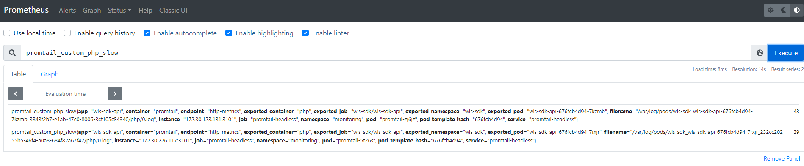

tags: loki, promtail, prometheus

# 08-5.1.日志告警

注意：
1. 如果没有特殊指明，本文档的所有操作**均在 wls-k8s-01 节点上执行**；
2. 前提已安装好Loki [08-5.Loki插件](08-5.Loki插件.md)

## 配置Promtail

1.添加监控指标：

``` bash
$ cd /opt/k8s/work/loki-server/promtail
$ cat values.yaml
​```
...
pipelineStages:
- docker: {}
- match:
    selector: '{app="wls-sdk-api"}'
    stages:
    - regex:
        expression: '(?P<slow>executing too slow.*)'
    - metrics:
        php_slow:
          type: Counter
          description: "PHP slow execution"
          source: slow
          config:
            action: inc
...
​```
```

2.开启serviceMonitor配置（Prometheus Operator CRD资源）：

``` bash
$ cat values.yaml
​```
...
serviceMonitor:
  enabled: true
  interval: "15s"
  additionalLabels: {}
  annotations: {}
...
​```
```

3.更新

```bash
$ helm -n monitoring upgrade -f values.yaml promtail .
```

4.自行构造慢查询请求，通过curl访问查看指标是否正常生成

```bash
# ab工具并发访问测试接口
$ ab -n 1000 -c 200 http://xxxxx/aaa.php
# 访问promtail pod ip, 自定义指标生成后的格式promtail_custom_php_slow
$ curl http://promtail_pod_ip:3101/metrics|grep promtail_custom_php_slow
```

5.通过Prometheus UI查看是否收集到指标

```bash
$ kubectl port-forward --address 0.0.0.0 pod/prometheus-k8s-0 -n monitoring 9090:9090
Forwarding from 0.0.0.0:9090 -> 9090
```



## 添加告警规则

1.告警规则示例文件：

```
apiVersion: monitoring.coreos.com/v1
kind: PrometheusRule
metadata:
  labels:
    prometheus: k8s
    role: alert-rules
  name: php-rules
  namespace: monitoring
spec:
  groups:
  - name: PHPAlerts
    rules:
    - alert: PHPSlow
      expr: promtail_custom_php_slow > 5
      for: 1m
      labels:
        severity: warning
      annotations:
        summary: |
                {{ $labels.instance }} php executing too slow
        description: |
                namespace = {{ $labels.exported_namespace }},
                pod = {{ $labels.exported_pod }},
                container = {{ $labels.exported_container }},
                filename = {{ $labels.filename }},
                value = {{ $value }}
```

2.应用

```bash
$ kubectl apply -f php-prometheusRule.yaml
$ kubectl -n monitoring get PrometheusRule
NAME                              AGE
php-rules                         30s
```

