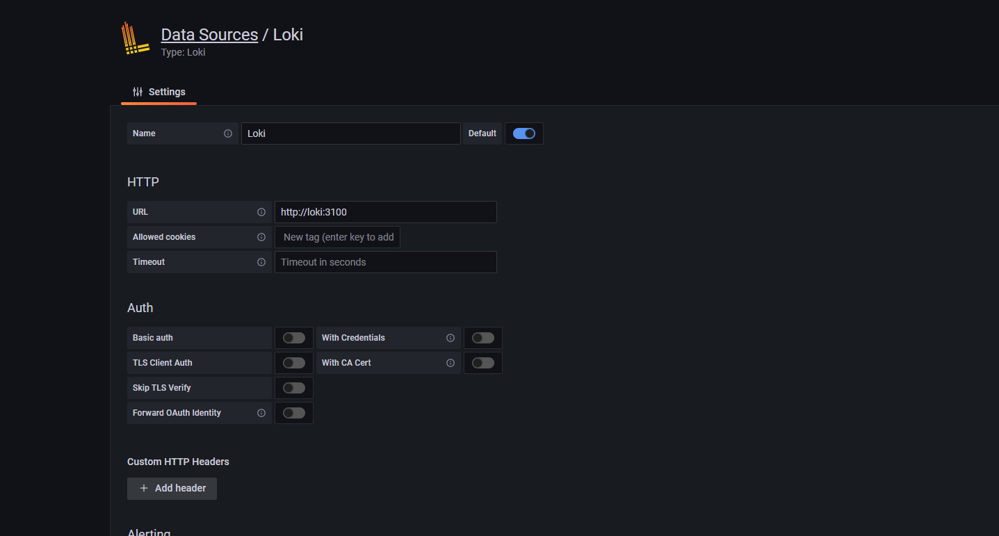
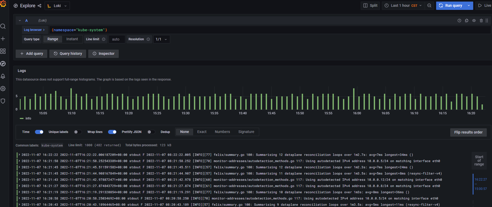

tags: loki,promtail

# 08-5. 部署 Loki 插件

<!-- TOC -->

- [08-5. 部署 Loki 插件](#08-5-部署-loki-插件)
    - [添加helm的chart库](#添加helm的chart库)
    - [安装Loki](#安装Loki)
    - [安装Promtail](#安装Promtail)
    - [Grafana添加Loki](#Grafana添加Loki)

<!-- /TOC -->

注意：
1. 如果没有特殊指明，本文档的所有操作**均在 wls-k8s-01 节点上执行**。
2. 创建存储类 >>> [H.部署NFS-StorageClass](H.部署NFS-StorageClass.md)

## 添加helm的chart库

将下载的 kubernetes-server-linux-amd64.tar.gz 解压后，再解压其中的 kubernetes-src.tar.gz 文件。

``` bash
$ helm repo add loki https://grafana.github.io/loki/charts
"loki" has been added to your repositories
$ helm repo update
Hang tight while we grab the latest from your chart repositories...
...Successfully got an update from the "loki" chart repository
Update Complete. ⎈ Happy Helming!⎈
$ helm repo list
NAME	URL
loki	https://grafana.github.io/loki/charts
```

### 安装Loki

1.查找loki相关chart，其中loki-stack是包含了loki和promtail

``` bash
$ helm search repo loki
NAME           	CHART VERSION	APP VERSION	DESCRIPTION                                       
loki/loki      	2.1.1        	v2.0.0     	DEPRECATED Loki: like Prometheus, but for logs.   
loki/loki-stack	2.1.2        	v2.0.0     	DEPRECATED Loki: like Prometheus, but for logs.   
loki/fluent-bit	2.0.2        	v2.0.0     	DEPRECATED Uses fluent-bit Loki go plugin for g...
loki/promtail  	2.0.2        	v2.0.0     	DEPRECATED Responsible for gathering logs and s...
```

2.下载相应的char包，修改配置再安装

``` bash
$ helm pull loki/loki
$ tar -zxf loki-2.1.1.tgz
$ cp values.yaml{,.tmpl}
$ diff values.yaml values.yaml.tmpl
92c92
<     max_look_back_period: 0s
---
>     max_look_back_period: 24h
94,95c94,95
<     retention_deletes_enabled: false
<     retention_period: 0s
---
>     retention_deletes_enabled: true
>     retention_period: 168h    
139c139,140
<   enabled: false
---
>   enabled: true
>   storageClassName: nfs-client
142c143
<   size: 10Gi
---
>   size: 50Gi
```

注：

max_look_back_period：为避免查询超过保留期的数据，必须小于或等于下方的时间值

retention_deletes_enabled：保留删除开启

retention_period： 超过 168小时的块数据将被删除（值需24的倍数）

persistence：

	-  enabled：开启持久卷
	-  storageClassName：存储类
	-  size：存储空间容量

3.安装

``` bash
$ helm upgrade --install loki loki/ -n monitoring
```

### 安装Promtail

1.下载相应的char包，修改配置再安装

``` bash
$ helm pull loki/promtail
$ tar -zxf promtail-2.0.2.tgz
$ cp values.yaml{,.tmpl}
$ diff values.yaml values.yaml.tmpl
32c32
<   serviceName: "loki"  # Defaults to "${RELEASE}-loki" if not set
---
>   serviceName: ""  # Defaults to "${RELEASE}-loki" if not set

$ helm upgrade --install promtail promtail/ -n monitoring
```

## 检查执行结果

``` bash
$ helm list -n monitoring
NAME    	NAMESPACE 	REVISION	UPDATED                                	STATUS  	CHART         	APP VERSION
loki    	monitoring	1       	2022-08-05 15:56:33.707839081 +0800 CST	deployed	loki-2.1.1    	v2.0.0     
promtail	monitoring	1       	2022-08-05 16:14:06.597497013 +0800 CST	deployed	promtail-2.0.2	v2.0.0     
```

##  Grafana添加Loki



查看收集到的日志；

