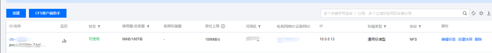

tags: CFS, CSI

# 11-1.持久存储-CFS

<!-- TOC -->

- [11-1. 持久存储-CFS](#11-1. 持久存储-CFS)
    - [下载资源文件](#下载资源文件)
    - [配置与安装](#配置与安装)
    - [测试](#测试)

<!-- /TOC -->

注意：
1. 如果没有特殊指明，本文档的所有操作**均在 wls-k8s-01 节点上执行**。
2. 请提前去腾讯云注册子账号，赋予 **CFS** 权限，生成 **SECRET**
3. 部署环境
   - kubernetes **v1.23.8**
   - Ubuntu 20.04 LTS (**5.4.0-109-generic**)
4. 如果需要文件锁功能，请使用 **NFS 4.0** 
5. kubelet运行目录已修改至 **/project/k8s/k8s/kubelet**

## 下载资源文件

按照[官方文档](https://github.com/TencentCloud/kubernetes-csi-tencentcloud/blob/master/docs/README_CFS.md)说明下载对应的资源文件。

- secret.yaml
- csi-nodeplugin-cfsplugin-new.yaml
- csi-provisioner-cfsplugin-new.yaml
- csi-cfs-csidriver-new.yaml
- csi-cfs-rbac.yaml

## 配置与安装

kubelet运行目录已修改为 **/project/k8s/k8s/kubelet**，需要修改 csi-nodeplugin-cfsplugin-new.yaml 配置。

``` bash
$ diff csi-nodeplugin-cfsplugin-new.yaml csi-nodeplugin-cfsplugin-new.yaml.back
36c36
<             - "--kubelet-registration-path=/project/k8s/k8s/kubelet/plugins/com.tencent.cloud.csi.cfs/csi.sock"
---
>             - "--kubelet-registration-path=/var/lib/kubelet/plugins/com.tencent.cloud.csi.cfs/csi.sock"
72c72
<               mountPath: /project/k8s/k8s/kubelet/pods
---
>               mountPath: /var/lib/kubelet/pods
77c77
<             path: /project/k8s/k8s/kubelet/plugins/com.tencent.cloud.csi.cfs
---
>             path: /var/lib/kubelet/plugins/com.tencent.cloud.csi.cfs
81c81
<             path: /project/k8s/k8s/kubelet/pods
---
>             path: /var/lib/kubelet/pods
85c85
<             path: /project/k8s/k8s/kubelet/plugins_registry
---
>             path: /var/lib/kubelet/plugins_registry
91d90
< 
```

使用base64将腾讯云账号生成的SECRET进行编码，配置到secret.yaml。例：

``` bash
$ echo -n "<SECRET_ID>" | base64
$ echo -n "<SECRET_KEY>" | base64
$ cat secret.yaml
apiVersion: v1
kind: Secret
metadata:
  name: cfs-csi-api-key
  namespace: kube-system
data:
  TENCENTCLOUD_CFS_API_SECRET_ID: "MTIzNDU2OTg3YWFiYmNj"
  TENCENTCLOUD_CFS_API_SECRET_KEY: "Y2NiYmFhNzg5NjU0MzIx"
```

配置完成后，执行安装。

```bash
$ kubelete apply -f .
# 查看状态
$ kubectl -n kube-system get pods
NAME                                       READY   STATUS    RESTARTS       AGE
...
csi-provisioner-cfsplugin-0                2/2     Running   0              22h
csi-nodeplugin-cfsplugin-67d94             2/2     Running   0              16h
csi-nodeplugin-cfsplugin-6kf2z             2/2     Running   0              16h
csi-nodeplugin-cfsplugin-jv4g4             2/2     Running   0              16h
csi-nodeplugin-cfsplugin-m5b8d             2/2     Running   0              16h
csi-nodeplugin-cfsplugin-sf7bm             2/2     Running   0              16h
...
```

## 测试

1.创建StorageClass资源

``` bash
$ cat dynamic-storage.yaml
apiVersion: storage.k8s.io/v1
kind: StorageClass
metadata:
  name: tencent-cfs
parameters:
  subdir-share: "true" 
  vpcid: vpc-xxxxx
  subnetid: subnet-xxxxx
  vers: "4"
  resourcetags: ""
provisioner: com.tencent.cloud.csi.cfs
reclaimPolicy: Retain
volumeBindingMode: Immediate
```

- reclaimPolicy：回收策略，建议设置Retain， 如果设置为Delete，在将pv删除时，腾讯云创建的CFS资源也会一并删除
- vers：看项目需求，如果需要文件锁功能使用4，也就是NFS4.0
- vpcid：创建的文件存储所在的私有网络 ID
- subnetid：创建的文件存储所在的子网 ID

2.测试pod

``` bash
$ cat t-pod.yaml
apiVersion: v1
kind: Pod
metadata:
  name: nginx
spec:
  containers:
  - image: ccr.ccs.tencentyun.com/qcloud/nginx:1.9
    imagePullPolicy: Always
    name: nginx
    ports:
    - containerPort: 80
      protocol: TCP
    volumeMounts:
      - mountPath: /var/www
        name: data-cfsplugin
  volumes:
  - name: data-cfsplugin
    persistentVolumeClaim:
      claimName: data-cfsplugin
---
apiVersion: v1
kind: PersistentVolumeClaim
metadata:
  name: data-cfsplugin
spec:
  storageClassName: tencent-cfs
  accessModes:
  - ReadWriteMany
  resources:
    requests:
      storage: 10Gi
```

3.执行后动态创建对应的pv，cfs资源，结果如下：

```bash
$ kubectl -n sdk-global-loki get pvc,pv
root@wls-k8s-01:~# kubectl get pvc,pv
NAME                                  STATUS   VOLUME                                     CAPACITY  ACCESS MODES  STORAGECLASS   AGE
persistentvolumeclaim/data-cfsplugin  Bound    pvc-b423300a-7da8-4cbf-8d34-070bbf89aaf2   10Gi      RWO           tencent-cfs 
3m
NAME                                                        CAPACITY  ACCESS MODES   RECLAIM POLICY  STATUS   CLAIM                                           STORAGECLASS      REASON   AGE
persistentvolume/pvc-b423300a-7da8-4cbf-8d34-070bbf89aaf2   10Gi      RWO            Retain          Bound    default/data-cfsplugin                     tencent-cfs                19h
```




4.本文档所使用的资源文件可在 [example/cfs](./example/cfs) 目录获取


## 注解

**1.csi-provisioner-cfsplugin-new.yaml**

>   **cfs 容器**：负责实际的卷创建、删除等操作，并暴露自身 sock 供 csi-provisioner 容器调用
>
>   **csi-provisioner 容器**：负责watch集群PV/PVC资源，设置 provisioner 为 "com.tencent.cloud.csi.cfs" ，如果需要同步的PVC资源使用StorageClass方式，则将该StorageClass的provisioner与设置的provisioner进行比对，相同则通过 cfs 容器暴露的sock进行PV卷的创建

**2.csi-nodeplugin-cfsplugin-new.yaml**

>    **cfs 容器**：负责实际的卷挂载、卸载等操作，并暴露自身 sock 供 driver-registrar 容器、kubelet调用
>
>    **driver-registrar 容器**：
>
> -  使用 cfs 容器暴露的 sock 地址作为参数，并调用获取CSI插件名称
> -   在 /project/k8s/k8s/kubelet/plugins_registry 目录创建 com.tencent.cloud.csi.cfs-reg.sock文件，供 kubelet调用 ，并将 cfs 容器的CSI插件的 sock地址以及名称返回给 kubelet（kubelet 通过 Watcher 可以发现该 socket）

**3.csi-cfs-csidriver-new.yaml**

> **CSIDriver**
>
> - 描述集群中部署的CSI Plugin列表，需要根据插件类型创建
> - 定义Kubernetes调用CSI Plugin的行为：
>
> ​       attachRequired：定义Plugin是否支持Attach功能，如果定义为false，Kubernetes不会调用Attach接口
>
> ​       podInfoOnMount：定义Kubernetes调用Mount接口时，是否带上Pod信息
>
> ​       fsGroupPolicy ：定义底层卷是否支持在挂载之前更改卷的所有权和权限
>
> ​              file：表示容器中的进程将以容器组的主文件系统组（`root`）访问文件系统
>
> ​       volumeLifecycleModes：定义这个 CSI 卷驱动支持哪种类别的卷
>
> ​            Persistent：持久存储
>
> ​            Ephemeral：临时存储，与Pod生命周期绑定，当Pod被删除时，持久卷自动删除
>
> 
>
> **CSINode**
>
> 定义集群中CSI节点信息，node-driver-registrar 启动时创建
>
> 作用：
>
> - 每一个新的CSI Plugin注册后，都会在CSINode里添加一个CSINode信息
> - Controller Manager、Scheduler依赖CSINode信息来确定一个节点的CSI驱动是否可用
> - Controller Manager实现Topoloy-Aware Provsion的时候，通过CSINode信息获取拓扑信息

