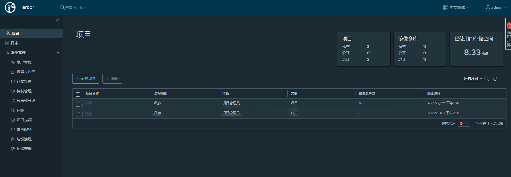

tags: registry, harbor

# D. 部署 harbor 私有仓库

<!-- TOC -->

- [D. 部署 harbor 私有仓库](#d-部署-harbor-私有仓库)
    - [使用的变量](#使用的变量)
    - [下载文件](#下载文件)
    - [导入 docker images](#导入-docker-images)
    - [创建 harbor nginx 服务器使用的 x509 证书](#创建-harbor-nginx-服务器使用的-x509-证书)
    - [修改 harbor.cfg 文件](#修改-harborcfg-文件)
    - [加载和启动 harbor 镜像](#加载和启动-harbor-镜像)
    - [访问管理界面](#访问管理界面)
    - [harbor 运行时产生的文件、目录](#harbor-运行时产生的文件目录)
    - [docker 客户端登陆](#docker-客户端登陆)
    - [其它操作](#其它操作)

<!-- /TOC -->

本文档介绍使用 docker-compose 部署 harbor 私有仓库的步骤。

## 使用的变量

本文档用到的变量定义如下：

``` bash
$ export NODE_IP=10.0.0.5 # 当前部署 harbor 的节点 IP
$ export NODE_DOMAIN=harbor.xxx.xx # harbor 访问域名
```

## 下载文件

从 harbor [发布页面](https://github.com/vmware/harbor/releases)下载最新的 harbor 离线安装包

``` bash
$ wget --continue https://github.com/goharbor/harbor/releases/download/v2.5.3/harbor-offline-installer-v2.5.3.tgz
$ tar -xzvf harbor-offline-installer-v2.5.3.tgz
```

## 导入 docker images

导入离线安装包中 harbor 相关的 docker images：

``` bash
$ cd harbor
$ docker load -i harbor.v2.5.3.tar.gz
```

## 创建 harbor nginx 服务器使用的 x509 证书

创建 harbor 证书签名请求：

``` bash
$ cat > harbor-csr.json <<EOF
{
  "CN": "harbor",
  "hosts": [
    "127.0.0.1",
    "${NODE_IP}",
    "${NODE_DOMAIN}"
  ],
  "key": {
    "algo": "rsa",
    "size": 2048
  },
  "names": [
    {
      "C": "CN",
      "ST": "ChengDu",
      "L": "ChengDu",
      "O": "k8s",
      "OU": "isempty"
    }
  ]
}
EOF
```

+ hosts 字段指定授权使用该证书的当前部署节点 IP，harbor 访问域名；

生成 harbor 证书和私钥：

``` bash
$ cfssl gencert -ca=/etc/kubernetes/cert/ca.pem \
  -ca-key=/etc/kubernetes/cert/ca-key.pem \
  -config=/etc/kubernetes/cert/ca-config.json \
  -profile=kubernetes harbor-csr.json | cfssljson -bare harbor

$ ls harbor*
harbor.csr  harbor-csr.json  harbor-key.pem harbor.pem

$ sudo mkdir -p /etc/harbor/ssl
$ sudo mv harbor*.pem /etc/harbor/ssl
$ rm harbor.csr  harbor-csr.json
```

## 修改 harbor.cfg 文件

``` bash
$ cp harbor.yml{,.tmpl}
$ vim harbor.yml
$ diff harbor.yml{,.tmpl}
5c5
< hostname: your.harbor.domain
---
> hostname: reg.mydomain.com
17,18c17,18
<   certificate: /etc/harbor/ssl/harbor.pem
<   private_key: /etc/harbor/ssl/harbor-key.pem
---
>   certificate: /your/certificate/path
>   private_key: /your/private/key/path
34c34
< harbor_admin_password: xxxxxxxx
---
> harbor_admin_password: Harbor12345
39c39
<   password: xyyyyy
---
>   password: root123
47c47
< data_volume: /project/harbor/data
---
> data_volume: /data

```
## 加载和启动 harbor 镜像

``` bash
$ sudo mkdir -p /project/harbor/data
$ ./install.sh

[Step 0]: checking installation environment ...

Note: docker version: 19.03.15

Note: docker-compose version: v2.6.1

[Step 1]: loading Harbor images ...
...

[Step 2]: preparing environment ...
...

[Step 3]: checking existing instance of Harbor ...

[Step 4]: starting Harbor ...
Creating network "harbor_harbor" with the default driver
Creating harbor-log ... done
Creating redis              ... done
Creating harbor-adminserver ... done
Creating harbor-db          ... done
Creating registry           ... done
Creating harbor-ui          ... done
Creating harbor-jobservice  ... done
Creating nginx              ... done

✔ ----Harbor has been installed and started successfully.----

Now you should be able to visit the admin portal at https://10.0.0.5.
For more details, please visit https://github.com/vmware/harbor .
```

## 访问管理界面

确认所有组件都工作正常：

``` bash
$ docker-compose  ps
NAME                COMMAND                  SERVICE             STATUS              PORTS
harbor-core         "/harbor/entrypoint.…"   core                running (healthy)   
harbor-db           "/docker-entrypoint.…"   postgresql          running (healthy)   
harbor-jobservice   "/harbor/entrypoint.…"   jobservice          running (healthy)   
harbor-log          "/bin/sh -c /usr/loc…"   log                 running (healthy)   127.0.0.1:1514->10514/tcp
harbor-portal       "nginx -g 'daemon of…"   portal              running (healthy)   
nginx               "nginx -g 'daemon of…"   proxy               running (healthy)   0.0.0.0:80->8080/tcp, 0.0.0.0:443->8443/tcp
redis               "redis-server /etc/r…"   redis               running (healthy)   
registry            "/home/harbor/entryp…"   registry            running (healthy)   
registryctl         "/home/harbor/start.…"   registryctl         running (healthy)  
```

浏览器访问 `https://${NODE_IP}`，示例的是 `https://10.0.0.5`；

浏览器访问 `https://10.0.0.5:443`，用账号 `admin` 和 harbor.cfg 配置文件中的默认密码 `Harbor12345`（或者修改后的密码） 登陆系统。



## harbor 运行时产生的文件、目录

harbor 将日志打印到 /var/log/harbor 的相关目录下，使用 docker logs XXX 或 docker-compose logs XXX 将看不到容器的日志。

``` bash
$ # 日志目录
$ ls /var/log/harbor
core.log  jobservice.log  portal.log  postgresql.log  proxy.log  redis.log  registryctl.log  registry.log
$ # 数据目录，包括数据库、镜像仓库
$ ls /project/harbor/data/
ca_download  database  job_logs  redis  registry  secret
```

## docker 客户端登陆

将签署 harbor 证书的 CA 证书拷贝到 `/etc/docker/certs.d/${harbar访问地址}` 目录下

``` bash
$ sudo mkdir -p /etc/docker/certs.d/${harbar访问地址}
$ sudo cp /etc/kubernetes/cert/ca.pem /etc/docker/certs.d/${harbar访问地址}/ca.crt
```

登陆 harbor

``` bash
$ docker login ${harbar访问地址}
Username: admin
Password:
```

认证信息自动保存到 `~/.docker/config.json` 文件。

## 其它操作

下列操作的工作目录均为 解压离线安装文件后 生成的 harbor 目录。

``` bash
$ # 停止 harbor
$ docker-compose down -v
$ # 修改配置
$ vim harbor.yml
$ # 更修改的配置更新到 docker-compose.yml 文件
$ ./prepare
Clearing the configuration file: ./common/config/ui/app.conf
Clearing the configuration file: ./common/config/ui/env
Clearing the configuration file: ./common/config/ui/private_key.pem
Clearing the configuration file: ./common/config/db/env
Clearing the configuration file: ./common/config/registry/root.crt
Clearing the configuration file: ./common/config/registry/config.yml
Clearing the configuration file: ./common/config/jobservice/app.conf
Clearing the configuration file: ./common/config/jobservice/env
Clearing the configuration file: ./common/config/nginx/cert/admin.pem
Clearing the configuration file: ./common/config/nginx/cert/admin-key.pem
Clearing the configuration file: ./common/config/nginx/nginx.conf
Clearing the configuration file: ./common/config/adminserver/env
loaded secret from file: /data/secretkey
Generated configuration file: ./common/config/nginx/nginx.conf
Generated configuration file: ./common/config/adminserver/env
Generated configuration file: ./common/config/ui/env
Generated configuration file: ./common/config/registry/config.yml
Generated configuration file: ./common/config/db/env
Generated configuration file: ./common/config/jobservice/env
Generated configuration file: ./common/config/jobservice/app.conf
Generated configuration file: ./common/config/ui/app.conf
Generated certificate, key file: ./common/config/ui/private_key.pem, cert file: ./common/config/registry/root.crt
The configuration files are ready, please use docker-compose to start the service.
$ sudo chmod -R 766 common ## 防止容器进程没有权限读取生成的配置
$ # 启动 harbor
$ docker-compose up -d
```